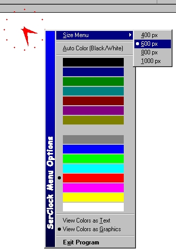

<div align="center">

## \[Analog onscreen clock with colored menu\]


</div>

### Description

Analog onscreen clock. Has very nice menu. Stays always on a top. Remember last position. Colors have to options: one of 16 system colors or mode «Auto», which chooses black/white color, depend on background. ToolTip - current date. You can drag it werever you want on a screen and choose a size from 400px to 1000px. Please rate it. Report any bugs to SergeyO@MailCity.com
 
### More Info
 


<span>             |<span>
---                |---
**Submitted On**   |2003-01-10 15:53:16
**By**             |[Sergey Olekhnovich](https://github.com/Planet-Source-Code/PSCIndex/blob/master/ByAuthor/sergey-olekhnovich.md)
**Level**          |Intermediate
**User Rating**    |4.7 (71 globes from 15 users)
**Compatibility**  |VB 6\.0
**Category**       |[Miscellaneous](https://github.com/Planet-Source-Code/PSCIndex/blob/master/ByCategory/miscellaneous__1-1.md)
**World**          |[Visual Basic](https://github.com/Planet-Source-Code/PSCIndex/blob/master/ByWorld/visual-basic.md)
**Archive File**   |[\[Analog\_on1533271222003\.zip](https://github.com/Planet-Source-Code/sergey-olekhnovich-analog-onscreen-clock-with-colored-menu__1-42646/archive/master.zip)

### API Declarations

```
SetMenuDefaultItem
GetSysColor
GetMenuItemInfo
CreatePopupMenu
TrackPopupMenu
AppendMenu
ModifyMenu
DestroyMenu
GetCursorPos
CopyMemory
BitBlt
SetRect
DrawCaption
GetMenuItemRect
GetMenuItemCount
GetPixel
SetPixel
WindowFromPoint
GetClassName
SetWindowLong
CallWindowProc
PostMessage
CombineRgn
CreateEllipticRgn
CreateRectRgn
CreatePolygonRgn
GetDC
GetPixel
ReleaseDC
SetWindowPos
SetWindowRgn
BeginPath
EndPath
PathToRegion
CreateSolidBrush
ReleaseCapture
SendMessage
SetTimer
KillTimer
TimerProc
InitCommonControls
InitCommonControlsEx
CreateWindowEx
SetWindowPos
GetClientRect
DestroyWindow
```


